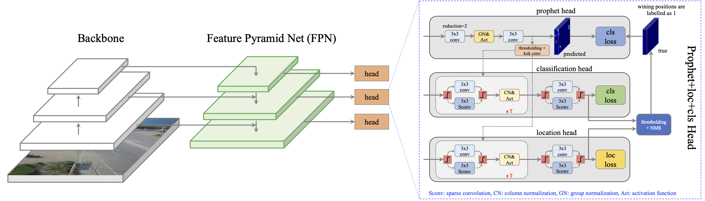

# Train in Dense and Test in Sparse: A Method for Sparse Object Detection in Aerial Images

This project hosts the code for implementing the TDTS algorithm for object detection, as presented in our paper:

    Train in Dense, Test in Sparse: A Method for Sparse Object Detection in Aerial Images;
    Kun Ding, Guojin He, Huxiang Gu, Zisha Zhong, Shiming Xiang and Chunhong Pan;
    IEEE Geoscience and Remote Sensing Letters, 2020.

The full paper is available at: [https://doi.org/10.1109/LGRS.2020.3035844](https://doi.org/10.1109/LGRS.2020.3035844). 



## Highlights
- **General:** TDTS is a general method to exploit the spatial sparsity of aerial images for improving inference speed.
- **Flop counter:** Enable to count the model's flops.

## Updates
   - 2020/11/25: upgrade to pytorch1.6
   - 2020/11/23: improve column norm code, slightly faster
   - 2020/11/19: first commit

## Installation
Our code is mainly based on [maskrcnn-benchmark](https://github.com/facebookresearch/maskrcnn-benchmark) 
and [spconv](https://github.com/traveller59/spconv), please refer to these repositories for installation and usage.

## Test
The inference command line on VisDrone-2019 val split:

    python tools/test_net.py \
        --config-file configs/visdrone_tdts/tdts_R_18_FPN_1x_800x1333_visdrone_cn_mw1.5-nms0.yaml \
        MODEL.WEIGHT models/tdts_R_18_FPN_1x_800x1333_visdrone_cn_mw1.5-nms0.pth \
        TEST.IMS_PER_BATCH 1
        
## Train
To train a new model on VisDrone-2019 train split, run:

    python -m torch.distributed.launch \
        --nproc_per_node=2 \
        --master_port=$((RANDOM + 10000)) \
        tools/train_net.py \
        --config-file configs/visdrone_tdts/tdts_R_18_FPN_1x_800x1333_visdrone_cn_mw1.5-nms0.yaml \
        DATALOADER.NUM_WORKERS 4 \
        OUTPUT_DIR training_dir/tdts_R_18_FPN_1x_800x1333_visdrone_cn_mw1.5-nms0

## Models
Here we provide the following trained models.

Model | Backbone | Train Size| FPS@1 | FPS@8 | AP | AP50 | AP75 | Link
--- |:---:|:---:|:---:|:---:|:---:|:---:|:---:|:---:
FCOS        | ResNet-18 | [640,800]x1333 | 34.2 | 30.7 | 22.36 | 41.14 | 22.09 | [ajpb](https://pan.baidu.com/s/1CQSRA5DrHeOkS9U3QH2VFA)
FCOS        | ResNet-50 | [512,640]x1024 | 34.7 | 39.2 | 20.55 | 38.35 | 20.23 | [0nbm](https://pan.baidu.com/s/13z966uFkfrzJZ15VI6duyg)
TDTS_dense  | ResNet-18 | [640,800]x1333 | 30.3 | 25.1 | 23.00 | 41.98 | 22.93 | [wq59](https://pan.baidu.com/s/1y_2TquarFuKqG4MgKxJE3Q)
TDTS_sparse | ResNet-18 | [640,800]x1333 | 40.9 | 51.6 | 22.68 | 41.22 | 22.70 | [wq59](https://pan.baidu.com/s/1y_2TquarFuKqG4MgKxJE3Q)
TDTS_dense  | ResNet-50 | [512,640]x1024 | 33.2 | 34.0 | 21.91 | 40.25 | 21.79 | [krbk](https://pan.baidu.com/s/1X2-gEfmbQdMk8OiMYCE6cg)
TDTS_sparse | ResNet-50 | [512,640]x1024 | 37.6 | 48.6 | 21.71 | 39.81 | 21.63 | [krbk](https://pan.baidu.com/s/1X2-gEfmbQdMk8OiMYCE6cg)

* The FPS is tested on a RTX Titan GPU card.

## Contributing to the project
Any pull requests or issues are welcome.

## Citations
Please consider citing our paper in your publications if the project helps your research. BibTeX reference is as follows.
```
@inproceedings{tdts,
  title   =  {Train in Dense and Test in Sparse: A Method for Sparse Object Detection in Aerial Images},
  author  =  {Ding, Kun and He, Guojin and Gu, Huxiang and Zhong, Zisha and Xiang, Shiming and Pan, Chuhong},
  booktitle =  {IEEE Geosci. Remote Sens. Lett.},
  year    =  {2020}
}
```

## License

For academic use, this project is licensed under the 2-clause BSD License - see the LICENSE file for details. For commercial use, please contact the authors. 
